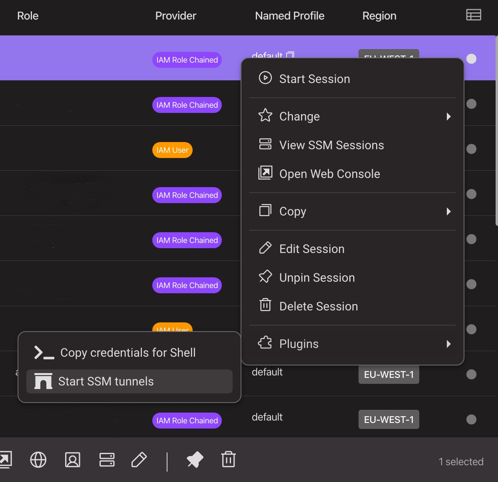

<p align="center">
  
    
</p>

<h1 align="center">Leapp<br>SSM Tunnels Plugin</h1>

<h2>Introduction</h2>
<p>This plugin aims to help developers and AWS users in general  to access private resources in all their AWS accounts in one click!</p>

<h2>How it works</h2>
As a TypeScript novice I tried to keep the code as simple as possible.<br><br>
The plugin uses the aws ssm start-session command to create secure and controlled connections to public and private AWS resources such as EC2 instances.
<br><br>
 More specifically, it uses a particular feature of SSM Session Manager that AWS describes <a href="https://aws.amazon.com/it/about-aws/whats-new/2022/05/aws-systems-manager-support-port-forwarding-remote-hosts-using-session-manager/">here</a> as:
 <br>
<q>Session Manager supports forwarding connections from a client machine to ports on remote hosts. With remote port forwarding, you can now use a managed instance as a “jump host” to securely connect to an application port on remote servers, such as databases and web servers, without exposing those servers to outside network.</q>

<h2>How to configure the tunnels you need</h2>

This plugin makes use of a json configuration file (`ssm-conf.json`) where you can specify the parameters needed to establish the tunnel.

You can find an example of such file in this repository called `ssm-conf.json.example`.

```json
[
  {
    "sessionName": "session1",
    "configs": [
      {
        "target": "i-0221y321bde21hi72",
        "host": "account1-db.eu-south-1.rds.amazonaws.com",
        "portNumber": "5432",
        "localPortNumber": "3333"
      },
      {
        "target": "i-0221y321bde21hi72",
        "host": "vpc-elasticsearch-es-xxxxxxxxxxxxxxx.eu-south-1.es.amazonaws.com",
        "portNumber": "443",
        "localPortNumber": "9090"
      }
    ] 
  },
  {
    "sessionName": "session2",
    "configs": [
      {
        "target": "i-4321t4432ced62ih53",
        "host": "account2-db.us-east-1.rds.amazonaws.com",
        "portNumber": "5432",
        "localPortNumber": "3333"
      }
    ] 
  }
]
```

You can use the previous example to create your own file and place it in the path that you prefer. Then set the SSM_PLUGIN_PATH environment variable with it.<br><br>
For example:<br>
`export SSM_PLUGIN_PATH=~/ssm-conf.json`

<h2>Plugin in action!</h2>
It's possible to install and use this plugin as well explained by the Noovolari team throughout the Leapp's documentation that you can find here:
<a href="https://docs.leapp.cloud/0.16.2/plugins/plugins-introduction/">Leapp plugins introduction</a><br><br>

The npm package name to find and install this plugin is: `leapp-ssm-tunnels-plugin`

